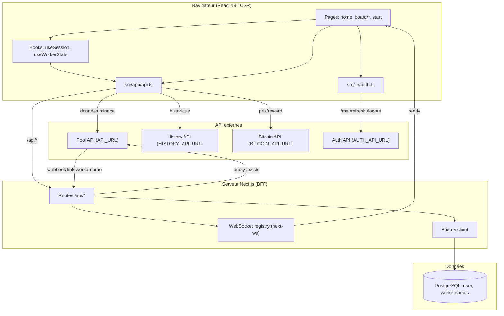
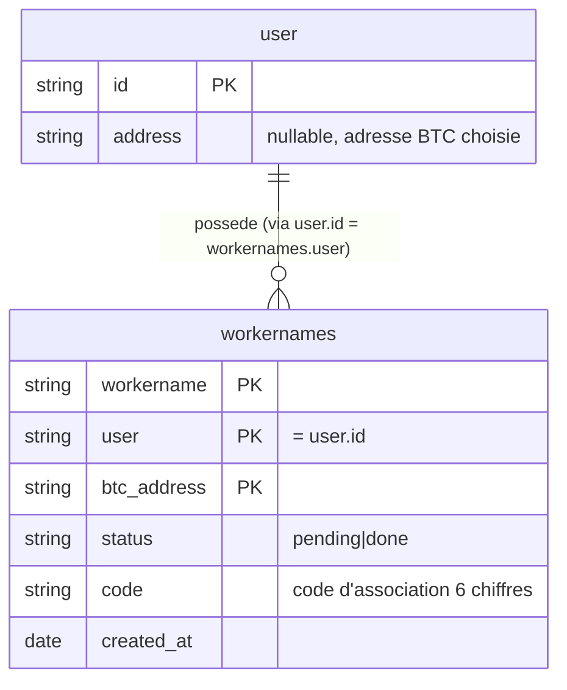

# Graphe de connaissance

Représentation explicite du système sous forme de **nœuds** (unités de code /
services / entités) et **arêtes** (relations). Destiné à être requêté par un agent
avant toute modification.

## Légende des types de nœuds

- `page` — page/route UI (App Router)
- `hook` — hook React (SWR)
- `route` — route API interne Next.js (`src/app/api/**`)
- `client` — module d'accès aux API (fetch)
- `server` — module côté serveur (BDD, WebSocket, env)
- `lib` — utilitaire pur
- `model` — type/interface de données
- `entity` — table PostgreSQL (Prisma)
- `external` — service externe
- `config` — configuration / infra

## Nœuds principaux

| id | type | fichier | rôle |
|----|------|---------|------|
| `home` | page | `src/app/page.tsx` | Accueil : recherche d'une adresse BTC |
| `board/workers` | page | `src/app/board/[id]/workers/page.tsx` | Liste des workers d'une adresse |
| `board/pool` | page | `src/app/board/[id]/pool/page.tsx` | Vue agrégée de la pool |
| `board/my` | page | `src/app/board/[id]/my/page.tsx` | Espace « mon compte » |
| `start` | page | `src/app/start/[id]/page.tsx` | Onboarding : association d'un mineur |
| `login`/`logout` | page | `src/app/login/page.tsx`, `src/app/logout/page.tsx` | Auth |
| `useSession` | hook | `src/app/hooks/useSession.ts` | Session utilisateur (SWR + `getMe`) |
| `useWorkerStats` | hook | `src/app/hooks/useWorkerStats.ts` | Historique d'un worker |
| `useTheme` | hook | `src/app/hooks/useTheme.ts` | Thème clair/sombre |
| `apiClient` | client | `src/app/api.ts` | Toutes les fonctions `fetch` (externe + interne) |
| `authClient` | client | `src/lib/auth.ts` | `getMe`, `refreshToken`, `logOut` |
| `route:exists` | route | `src/app/api/[address]/exists/route.ts` | Proxy « adresse existe ? » vers Pool API |
| `route:workernames` | route | `src/app/api/[address]/workernames/route.ts` | Liste des associations de l'utilisateur |
| `route:workername` | route | `src/app/api/[address]/workernames/[workername]/route.ts` | Vérifie / réserve un workername |
| `route:ws` | route | `src/app/api/[address]/workernames/[workername]/ws/route.ts` | Handshake WebSocket (UPGRADE) |
| `route:user` | route | `src/app/api/user/route.ts` | Upsert user + PATCH adresse |
| `route:token` | route | `src/app/api/user/token/route.ts` | Jeton WS chiffré |
| `route:webhook` | route | `src/app/api/webhooks/link-workername/route.ts` | Webhook pool : valide l'association |
| `prisma` | server | `src/server/Prisma.ts` | Client Prisma (adapter `pg`) |
| `websockets` | server | `src/server/websockets.ts` | Registre WS + chiffrement AES-GCM |
| `env` | server | `src/server/env.ts` | Lecture stricte des env serveur |
| `config` | lib | `src/lib/config.ts` | Config isomorphe (client `window.__CONFIG__` / serveur `process.env`) |
| `entity:user` | entity | `prisma/schema.prisma` | Table `user` |
| `entity:workernames` | entity | `prisma/schema.prisma` | Table `workernames` (association) |
| `ext:pool` | external | `API_URL` | API publique de la pool |
| `ext:history` | external | `HISTORY_API_URL` | Serveur d'historique |
| `ext:bitcoin` | external | `BITCOIN_API_URL` | Prix & récompense BTC |
| `ext:auth` | external | `AUTH_API_URL` / `AUTH_URL` | Service d'authentification |

## Arêtes (relations)

Format : `source --relation--> cible`.

### Pages → données
- `home --appelle--> apiClient.addresssExists --proxy--> route:exists --fetch--> ext:pool`
- `board/workers --appelle--> apiClient.{getPoolStats,getPoolWeight,getBtcPrice,getBtcBlockReward}`
- `board/pool --appelle--> apiClient.{getPoolStats,getPoolHistory,getPoolWeight}`
- `board/my --appelle--> apiClient.{getLinkedWorkers,patchUser}` + `useSession`
- `start --appelle--> apiClient.{getLinkedWorkers,getUserToken,registerWorkername}` + `useSession`
- `useWorkerStats --appelle--> apiClient.getWorkerStatsHistory --fetch--> ext:history`

### apiClient → cibles
- `apiClient.getPoolStats --fetch--> ext:pool` (`/api/stats/{address}`)
- `apiClient.getWorkerStatsHistory --fetch--> ext:history` (`/v1/{addr}/worker/{name}/{period}`)
- `apiClient.getPoolHistory --fetch--> ext:history` (`/v1/{addr}/pool`)
- `apiClient.getPoolWeight --fetch--> ext:history` (`/v1/{addr}/weights`)
- `apiClient.getBtcPrice --fetch--> ext:bitcoin` (`/v1/bitcoin-price`)
- `apiClient.getBtcBlockReward --fetch--> ext:bitcoin` (`/v1/bitcoin-block-reward`)
- `apiClient.{addresssExists,getLinkedWorkers,registerWorkername,getUserToken,patchUser} --fetch--> route:*` (interne)

### Routes → serveur / externe
- `route:exists --fetch--> ext:pool`
- `route:workername(GET) --lit--> entity:workernames`
- `route:workername(POST) --écrit--> entity:workernames` + `authClient.getMe`
- `route:workernames(GET) --lit--> entity:workernames` + `authClient.getMe`
- `route:user --upsert/update--> entity:user` + `authClient.getMe`
- `route:token --chiffre user_id--> websockets.encrypt`
- `route:ws --UPGRADE--> websockets` (registre `Map<userId, WebSocket>`)
- `route:webhook --valide--> entity:workernames` + `websockets.get(userId).send(ready)`
- `authClient.getMe --fetch--> ext:auth` (`/me`, refresh sur 401)

### Serveur → infra
- `prisma --adapter pg--> entity:user`, `entity:workernames`
- `websockets --dérive clé de--> SESSION_PASSWORD`
- `config --lit--> window.__CONFIG__ | process.env`

## Diagramme — composants & flux

## Diagramme — modèle de données

> Note : la relation `user`↔`workernames` n'est **pas** déclarée comme relation
> Prisma (pas de foreign key). Le lien est logique via `workernames.user = user.id`.

## Points d'attention pour un agent

- `src/app/api.ts` mélange appels **externes** (URL absolue via `config`) et **internes**
  (`/api/...`). Vérifier la cible avant de modifier un endpoint.
- `config` est **isomorphe** : côté client il lit `window.__CONFIG__` (injecté au runtime),
  côté serveur `process.env`. Une nouvelle URL doit être ajoutée aux **deux** ainsi qu'à
  `docker-entrypoint.sh` et `src/types/global.d.ts`.
- Les migrations Prisma tournent dans un **conteneur séparé** (`migrator`) ; l'app attend
  un flag avant de démarrer (voir `deployment.md`).
