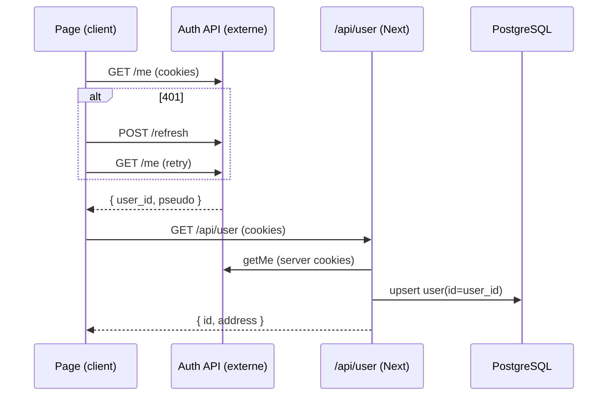

# Parcours métier (workflows)

Fiches des flux transverses, utiles pour comprendre les interactions entre pages,
routes, BDD, WebSocket et services externes.

---

## 1. Authentification

- L'app délègue l'auth à un **service externe** (`AUTH_API_URL`), basé sur des **cookies**.
- `getMe()` (`src/lib/auth.ts`) récupère l'utilisateur ; sur `401`, tente un `POST /refresh`
  puis rejoue la requête une fois.
- Côté **serveur** (routes API), on transmet les cookies via
  `getServerCookieHeader()` (`src/lib/auth.server.ts`, `next/headers`).
- Redirection vers login quand non authentifié :
  `window.location.href = ${AUTH_URL}/login?redirect=${BASE_URL}${path}` (ex. onboarding).
- Le hook `useSession()` combine `getMe()` + `GET /api/user` (upsert du user local) et
  expose `{ user, isLoading, mutate }`.



---

## 2. Association d'un workername (onboarding `/start/[id]`)

C'est le flux métier central. Objectif : lier un mineur (`workername`) à un compte,
en prouvant la possession via un **code** que le mineur transmet à la pool.

Acteurs : la page `start`, les routes internes, la table `workernames`, le **WebSocket**,
et un **webhook** appelé par la Pool.

Machine à états de `start/page.tsx` (`currentStep`) :
- `3` : pas de user / pas de token / pas d'association → étape S1 (choix du workername).
- `4` : association `pending` (code affiché) → étape S2, en attente de validation.
- `5` : association `done` mais `user.address` absent → étape S3 (renseigner l'adresse).
- `6` : tout est prêt → étape S4.

Séquence :

```mermaid
sequenceDiagram
  participant UI as /start/[id]
  participant API as Next API
  participant DB as workernames
  participant WS as WebSocket registry
  participant Miner as Mineur + Pool

  UI->>API: POST /api/[addr]/workernames/[name]  (registerWorkername)
  API->>DB: create { status: pending, code: 6 chiffres }
  API-->>UI: { type:'new', code }
  UI->>API: GET /api/user/token
  API-->>UI: { token = encrypt(user_id) }
  UI->>WS: connect /api/[addr]/workernames/[name]/ws?token=...
  Note over Miner: L'utilisateur configure son mineur avec le code
  Miner->>API: POST /api/webhooks/link-workername (Bearer POOL_TOKEN)
  API->>DB: status -> done ; supprime réservations concurrentes
  API->>WS: websockets.get(userId).send({ ready:true })
  WS-->>UI: { ready:true }  => passe à l'étape suivante
```

Règles de réservation (`POST /api/[address]/workernames/[workername]`) :
- Refus si le workername est déjà `done` (`Already exists`).
- Refus si l'utilisateur a déjà une association `done` (`Max limit`, 1 workername/utilisateur).
- Refus si l'utilisateur a déjà une réservation `pending` (`Pending`).
- Sinon : crée une ligne `pending` avec un `code` aléatoire (`src/lib/Random.ts`).

Validation par le webhook (`POST /api/webhooks/link-workername`) :
- Authentifié par `Authorization: Bearer {POOL_TOKEN}`.
- Body Zod : `{ user, worker, code, lastSeen }`.
- Passe la ligne correspondante à `done`, **supprime** les réservations d'autres users
  pour ce `(btc_address, workername)`, puis pousse `{ ready:true }` sur le WS du user.

---

## 3. Notification temps réel (WebSocket)

- Registre en mémoire `Map<userId, WebSocket>` (`src/server/websockets.ts`), non partagé
  entre instances → suppose un déploiement mono-instance (ou sticky).
- Handshake : route `UPGRADE` (`.../ws/route.ts`, via `next-ws`) valide le `token`
  (`decrypt` AES-GCM basé sur `SESSION_PASSWORD`) → `user.id` → enregistre la socket.
- Keepalive : le client envoie `{type:"ping"}`, le serveur répond `{type:"pong"}`.
- Le webhook d'association est le seul émetteur de `{ ready:true }`.

---

## 4. Recherche d'une adresse (accueil)

`/` → `addresssExists(search)` → `GET /api/[address]/exists` → proxy Pool API
`GET /api/stats/{address}`. Si l'adresse existe → redirection vers
`/board/{address}/workers`.
